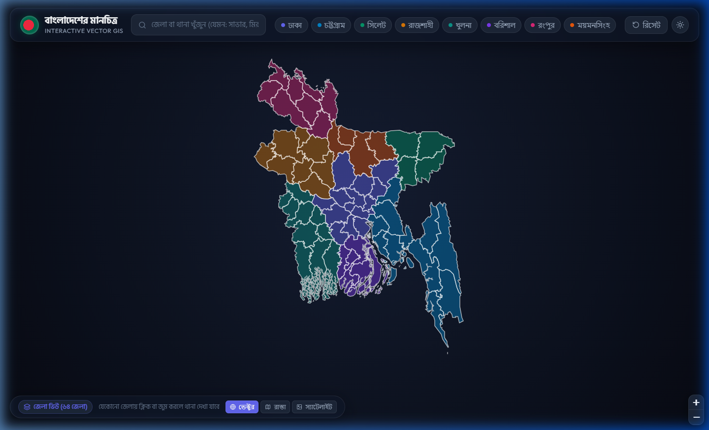

# 🇧🇩 বাংলাদেশের মানচিত্র - Interactive Bangladesh Map

একটি আধুনিক, দ্রুতগতির এবং সমৃদ্ধ ইন্টারেক্টিভ জিআইএস (GIS) ওয়েব অ্যাপ্লিকেশন। এতে বাংলাদেশের ৮টি প্রশাসনিক বিভাগ, ৬৪টি জেলা এবং ৫০০+ উপজেলার সীমানা, হোভার এফেক্ট, স্মার্ট জুম এবং দ্রুত অনুসন্ধান ব্যবস্থা অন্তর্ভুক্ত রয়েছে।



---

## ✨ প্রধান বৈশিষ্ট্যসমূহ (Key Features)

1. **বাংলাদেশের পূর্ণাঙ্গ ভেক্টর মানচিত্র (High-Performance Vector Map):**
   - কোনো ভারী এক্সটার্নাল টাইল ছাড়াই সম্পূর্ণ পরিষ্কার, মসৃণ ও ওয়াটারমার্ক-মুক্ত ভেক্টর রেন্ডারিং।
   - ৮টি বিভাগের জন্য নান্দনিক কালার প্যালেট।

2. **জেলা লেভেল হোভার ও ইন্টারঅ্যাকশন (৬৪ জেলা):**
   - যেকোনো জেলার ওপর মাউস রাখলে গ্লোয়িং বর্ডার ও সুন্দর টুলটিপে জেলার নাম (বাংলা ও ইংরেজি) এবং বিভাগের নাম প্রদর্শিত হয়।
   - জেলায় ক্লিক করলে ক্যামেরা স্মুথলি জুম ইন হয়ে সেই জেলায় ফোকাস হয়।

3. **স্বয়ংক্রিয় থানা ও উপজেলা লেয়ার (৫০০+ থানা):**
   - জুম লেভেল ৯ বা তার বেশি হলে (অথবা কোনো জেলা নির্বাচন করলে) তাৎক্ষণিকভাবে থানা ও উপজেলার নিখুঁত সীমানা দৃশ্যমান হয়।
   - থানার ওপর মাউস নিলে গোল্ডেন হাইলাইট এবং সংশ্লিষ্ট জেলার নামসহ পপআপ প্রদর্শিত হয়।

4. **বিভাগভিত্তিক দ্রুত জাম্প (Division Quick Pills):**
   - হেডার থেকে এক ক্লিকেই ঢাকা, চট্টগ্রাম, সিলেট, রাজশাহী, খুলনা, বরিশাল, রংপুর বা ময়মনসিংহ বিভাগে ক্যামেরা নিয়ে যাওয়া যায়।

5. **স্মার্ট সার্চ ও অটো-কমপ্লিট (Search Autocomplete):**
   - বাংলা বা ইংরেজি—যেকোনো ভাষায় জেলা বা থানার নাম টাইপ করলেই ড্রপডাউন সাজেশন আসে এবং সিলেক্ট করলে সরাসরি সেখানে জুম হয়।

6. **সাইডবার তথ্য প্যানেল ও ব্রেডক্রাম্ব:**
   - নির্বাচিত অঞ্চল অনুযায়ী `বাংলাদেশ > বিভাগ > জেলা > থানা` নেভিগেশন।
   - অক্ষাংশ (Lat), দ্রাঘিমাংশ (Lng) এবং জেলার অধীনে থাকা সকল থানার ক্লিকযোগ্য তালিকা।

7. **ডার্ক / লাইট মোড ও বেসম্যাপ সুইচ:**
   - ডার্ক মোড এবং লাইট মোডের মধ্যে তাৎক্ষণিক টগল।
   - ক্লিন ভেক্টর, ওপেনস্ট্রিটম্যাপ এবং স্যাটেলাইট মোড নির্বাচন করার সুবিধা।

---

## 🛠 প্রযুক্তি ও লাইব্রেরি (Tech Stack)

* **ফ্রেমওয়ার্ক:** React 19 + Vite
* **ম্যাপিং ইঞ্জিন:** Leaflet.js (Vector GeoJSON layers)
* **আইকন:** Lucide React
* **স্টাইলিং:** Vanilla CSS (Glassmorphism & Neon Design System)
* **ডাটা সোর্স:** BBS / Humanitarian Data Exchange (HDX) ও geoBoundaries (অপ্টিমাইজড ও সরলীকৃত GeoJSON)

---

## 🚀 লোকাল সেটআপ ও রান করার নিয়ম

```bash
# ডিপেন্ডেন্সি ইনস্টল করুন
npm install

# ডেভেলপমেন্ট সার্ভার চালু করুন
npm run dev
```

ব্রাউজারে `http://localhost:5173` ওপেন করে মানচিত্রটি উপভোগ করুন।

```bash
# প্রোডাকশন বিল্ড তৈরি করতে
npm run build
```

---

## 📄 লাইসেন্স
MIT License
